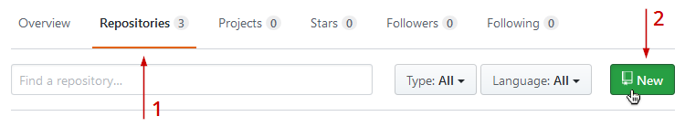
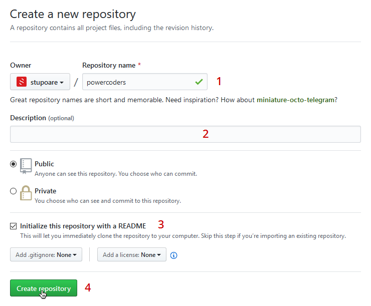
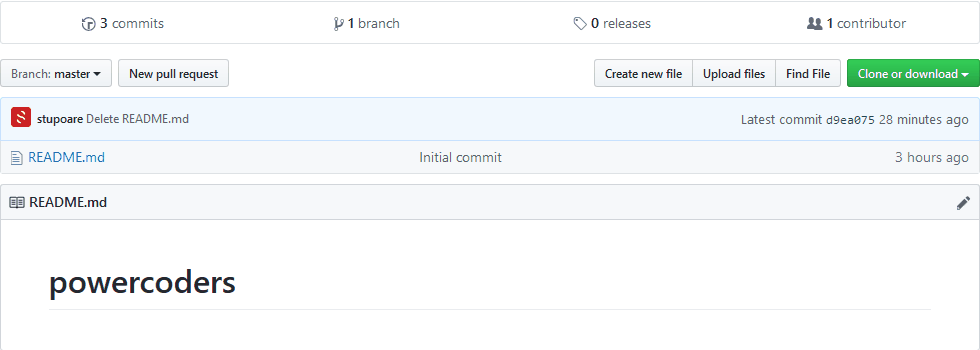
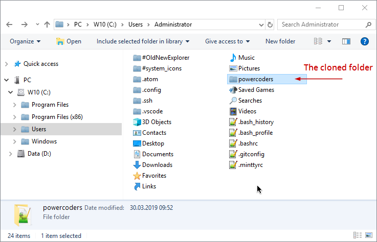

# GITHUB - ACCOUNT AND BASIC FOLDER STRUCTURE  
Please follow the steps bellow to create a Github account and set up your work repository for PowerCoders

<br>

## A. Create a [Github account](https://github.com/join)

We will create together a Github account for each one of you, in class, the first day<br>
If you are not present and you want to catch up, please go to directly to [Github Join page](https://github.com/join) and create an account on your own. If confused, follow the steps on [WikiHow](https://www.wikihow.com/Create-an-Account-on-GitHub)

> *Note: If you already have an account on Github, jump to the next section* 

<br>

## B. Create the "powercoders" repository

Follow the steps bellow in order to create a new repository named **`powercoders`**<br>
Go [here](https://help.github.com/en/articles/creating-a-new-repository) for more info.

> *Note: the name **"powercoders"** is important as we will use external links to show your work to other people, so, please keep this name !*

### 1. In the Click New


### 2. In the New repository page...


<br>

## C. Clone your Github repository locally

### 1. Copy the repo URL

<br>
Go [here](https://help.github.com/en/articles/cloning-a-repository) for more info.

### 2. Open your terminal bash ([Git SCM](https://git-scm.com/downloads)) and type the following commands
1. **`$ cd ~`** - Change directory to your user folder. This will go here: /c/Users/your-username

2. **`$ git clone https://github.com/`*your-username*`/powercoders.git`** - Change "your-username" with your actual username !

   The bash will show us something like this...
   ```sh
   $ git clone https://github.com/stupoare/powercoders.git
   Cloning into 'powercoders'...
   remote: Enumerating objects: 7, done.
   remote: Counting objects: 100% (7/7), done.
   remote: Compressing objects: 100% (4/4), done.
   remote: Total 7 (delta 0), reused 0 (delta 0), pack-reused 0
   Unpacking objects: 100% (7/7), done.
   ```

   ...and will clone the remote folder into our Windows user account :
   
   
   
<br>

## D. Create this folder structure INSIDE the "powercoders" folder :
### powercoders folder contents
``` sh
   portfolio         (this will hold your portfolio projects)
   workshop          (this is your training folder, create a folder for each subject taught in class !)
      CLI            (CLI exercices)
      HTML-CSS       (html-css exercices)
      JS             (js exercices)
      PHP            (php exercices)  
      ...            (etc.)
   `README.md        (this will be your global info file, we'll use it for training your "markdown" skills)
```
> *Note: empty folders will not be uploaded to Github but keep them here for future usage!*

<br>

## E. Clone PowerCoders support repo inside "powercoders" folder
1. #### Be sure to be into your *powercoders* folder :

   **`$ cd ~/powercoders`**

2. #### Clone the support repo

   **`$ git clone https://github.com/powercoders-lausanne/support.git`**
   ``` sh
   Cloning into 'support'...
   remote: Enumerating objects: 32, done.
   remote: Counting objects: 100% (32/32), done.
   remote: Compressing objects: 100% (20/20), done.
   remote: Total 32 (delta 6), reused 24 (delta 4), pack-reused 0
   Unpacking objects: 100% (32/32), done.
   ```

<br>

## F. Create an ".gitignore" file
This file is used to instruct git to ignore files and folders.

1. #### Put it at the root of your git folder :
   
   **`$ touch ~/powercoders/.gitignore`**

2. #### Open *.gitignore* file with your Editor and write this inside :

   **`support`** - the name of the folder you want to ignore

3. #### Save the file

> Note: we want to ignore the "support" folder ! This folder will contain the "official" support files for your training. You will update his contents each day with the "git pull" command (we'll see more about this in the Github course)

<br>

## G. Update your (cloned) support folder
In order to have the last changes from the remote suport repo, you have to update it like this :

1. #### Set url origin to the suport repo

   **`$ git remote set-url origin https://github.com/powercoders-lausanne/support.git`**

2. #### Go to your local support folder
   
   **`$ cd ~/powercoders/support`**
   


3. #### Fetch the the remote origin and reset/update local files
   
   **`$ git fetch origin master`**

   and after...

   **`$ git reset --hard origin/master`**

<br>

## H. "Push" changes to your remote repo


1. #### Let's make some changes in our local files.<br>
   For instance, we'll add a file named README.md into both, *portfolio* and *workshop* folders
   
   **`$ cd ~/powercoders/portfolio`** - goes directly to *portfolio* dir

   **`$ touch README.md`** - creates the file with this name into *portfolio* dir

   **`$ cd ../workshop`** - goes from *portfolio* to *workshop* dir

   **`$ touch README.md`** - creates a README.md file into *workshop* dir

   <br> 

2. #### Now, let's upload the changes to our remote repo
   
   **`$ cd ~/powercoders`** - go to local main dir, *powercoders*

   **`$ git add .`** - add all changes to **staging area**

   **`$ git commit -m "Add portfolio and workshop dirs"`** - add all changes to **staging area**

   **`$ git push`** - push changes to remote repo


   > *Note:*<br>
   > *When you push files/folders to remote, GitHub may ask you **to login***<br>
   > *We have a support chapter on how to permanently store your GitHub credentials :*<br>
   > **[GitHub - Storing your credentials](github-bash-login.md)**

   -------------------
   
   ### TIP

   While **push**ing your changes you may see an error like this :

   ``` shell
   ! [rejected] master -> master (non-fast-forward)
   error: failed to push some refs to 'git@github.com:user/project.git'
   hint: Updates were rejected because the tip of your current branch is behind
   hint: its remote counterpart. Merge the remote changes (e.g. 'git pull')
   hint: before pushing again.
   hint: See the 'Note about fast-forwards' in 'git push --help' for details.
   ```

   This is because you made some changes on remote and you do not have them on your local machine.<br>
   To resolve this issue try first to **pull** the changes from your remote :

   ``` shell
   $ git pull origin master
   ```

   If no errors try again the push command.<br>
   If you see an error, you can use **force** option :

   ``` shell
   $ git push -f origin master
   ```

   The **-f** option means *force*. This can cause the remote repository to lose commits; use it with care.<br>
   See more **[here](https://stackoverflow.com/a/18135171)**.