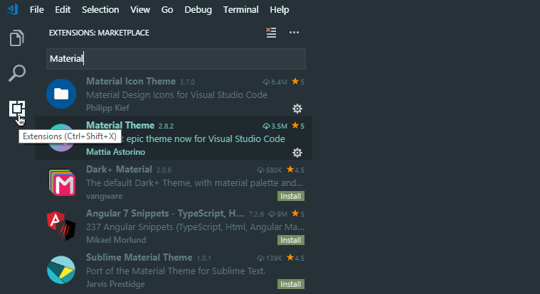
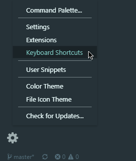

# Visual Code Editor
Useful information, keyboard shortcuts, extensions

<br>

## Installation
1. [Download Visual Studio Code](https://code.visualstudio.com/#alt-downloads)<br>
    Choose Windows, System Installer, 64bit ([direct .exe link](https://code.visualstudio.com/docs/?dv=win64))<br>
    If you do not have Administrator rights use the "User Installer" ([direct .exe link](https://code.visualstudio.com/docs/?dv=win64user))

2. Install - Usually installed in *C:\Program Files\Microsoft VS Code*
3. [Extensions Marketplace](https://marketplace.visualstudio.com/VSCode) - See bellow for Sorin's recommanded extensions

<br>

## UI Global view
Go to https://code.visualstudio.com/docs/getstarted/userinterface for more info


[An excellent VSCode intro tutorial](https://www.youtube.com/watch?v=fnPhJHN0jTE) - YouTube video

<br>

## Change settings view from UI to JSON
By default VC shows settings in a UI style. If you want more control and speed change it to JSON.

[Switch Settings from UI to JSON](https://www.youtube.com/watch?v=-wre2TFV4ws) - YouTube video

<br>

## Basic (Sorin's) settings
This is my JSON User Settings. I'll try to keep it up to date, so visit this page again...
``` javascript
{
    //Microsoft
    "telemetry.enableCrashReporter": false,
    "telemetry.enableTelemetry": false,
    "update.showReleaseNotes": false,
    "update.enableWindowsBackgroundUpdates": false,
    "liveServer.settings.donotShowInfoMsg": true,

    //EXPLORER
    "files.exclude": {
      "**/.git": false,
      ".gitignore": false
    },
    "explorer.confirmDragAndDrop": false,
    "explorer.confirmDelete": false,

    //WORKBENCH - UI look and feel
    "workbench.settings.editor": "json",
    "workbench.settings.useSplitJSON": true,
    "workbench.tips.enabled": false,
    "workbench.startupEditor": "newUntitledFile",
    "workbench.colorTheme": "Material Theme",
    "workbench.iconTheme": "material-icon-theme",
    
    //EDITOR - Code Look and feel
    "editor.fontFamily": "'Courier New', 'Source Code Pro', Consolas, monospace",
    "editor.fontSize": 16,
    "editor.minimap.enabled": false,
    "window.zoomLevel": 0,
    "editor.tabSize": 2,
    "[html]": {
    	"editor.matchBrackets": false
    },
    "editor.parameterHints.enabled": false,
    "editor.hover.enabled": false,

    //EMMET
    "emmet.triggerExpansionOnTab": true,

    //WHAT INTEGRATED TERMINAL SHELL
    //"terminal.integrated.shell.windows": "C:\\Windows\\System32\\cmd.exe"
    "terminal.integrated.shell.windows": "C:\\Program Files\\Git\\bin\\bash.exe",
}
```

<br>

## Install Extensions

#### Click Extensions in activity bar and type a keyword in the search box



#### Sorin's recommanded extensions. Search for and install :
1. Material Theme
2. Material Icon Theme
3. Live Server
4. Markdown Preview Github Styling
5. vscode-faker
6. ... `Others later in this course`

> *Note: if you find extensions with similar name, always install the most popular extension, look for number of downloads!*

<br>

## Useful Shorcuts<br>


#### 1. Keyboard Shortcuts

* **`CTRL + B`** - Toggle Activity bar visibility
* **`CTRL + SHIFT + P`** - Toggle Command Palette

These are the default values, you can change them if you want :



#### 2. EMMET (usually for HTML and CSS) - [VSCode Emmet](https://code.visualstudio.com/docs/editor/emmet)

> *Note: in order to have Emmet TAB commands working you have to add this to your settings :*<br>
`"emmet.triggerExpansionOnTab": true,`

Write a shorcut code and then press TAB key. Examples :

  ``` html
  h1                      => <h1></h1>
  p                       => <p></p>
  h2#some-id              => <h2 id="some-id"></h2>
  h2.some-class           => <h2 class="some-class"></h2>
  h2#some-id.some-class   => <h2 id="some-id" class="some-class"></h2>
  ```

  **`! + TAB`** will create a basic html structure :

  ``` html
  <!DOCTYPE html>
  <html lang="en">
  <head>
    <meta charset="UTF-8">
    <meta name="viewport" content="width=device-width, initial-scale=1.0">
    <meta http-equiv="X-UA-Compatible" content="ie=edge">
    <title>Document</title>
  </head>
  <body>
    
  </body>
  </html>
  ```
